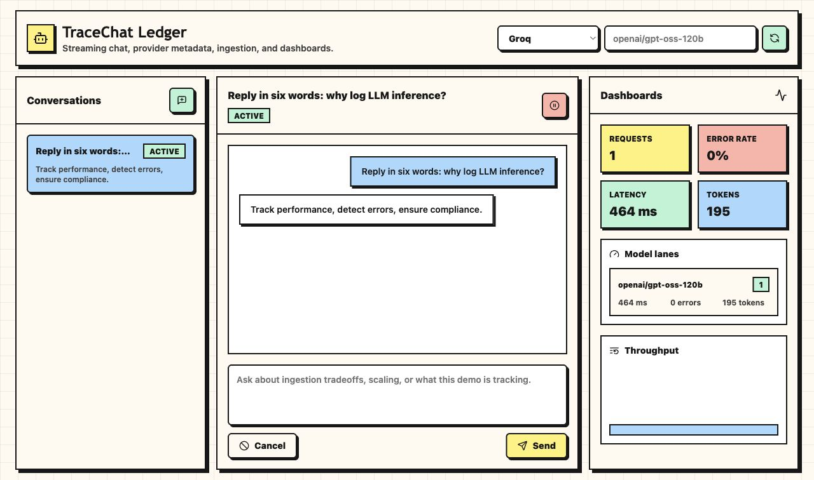
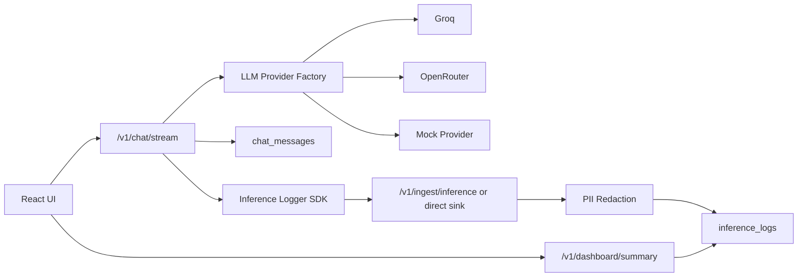

# TraceChat Ledger

A lightweight full-stack LLM chat application with streaming responses, multi-provider plumbing, near-real-time inference logging, ingestion validation, PII redaction, Postgres persistence, and simple operational dashboards.

The default provider is Groq using `openai/gpt-oss-120b`. A mock provider remains available for offline development, and OpenRouter support is included through the same provider factory.

## Stack

- `apps/api`: FastAPI, Pydantic, SQLAlchemy async, Postgres
- `apps/web`: Vite, React, TypeScript, Tailwind, shadcn-style UI primitives
- `docker-compose.yml`: one-command Postgres + API + web

## Quick Start

Copy the root env example and add a provider key:

```bash
cp .env.example .env
```

Then run:

```bash
docker compose up --build
```

Open [http://localhost:3000](http://localhost:3000).

## Local Development

Backend:

```bash
cd apps/api
python3 -m venv .venv
source .venv/bin/activate
pip install -e ".[dev]"
cp ../../.env.example .env
uvicorn app.main:app --reload
```

Frontend:

```bash
cd apps/web
npm install
npm run dev
```

Quality checks:

```bash
cd apps/api
source .venv/bin/activate
ruff check .
ruff format --check .
mypy app scripts
pytest

cd ../web
npm run lint
npm run typecheck
npm run build
```

Backend smoke tests:

```bash
cd apps/api
source .venv/bin/activate
DATABASE_URL=sqlite+aiosqlite:///./tracechat_smoke.db LLM_PROVIDER=mock python scripts/smoke_asgi.py --provider mock

DATABASE_URL=sqlite+aiosqlite:///./tracechat_groq_smoke.db \
LLM_PROVIDER=groq \
GROQ_API_KEY=your-key \
GROQ_MODEL=openai/gpt-oss-120b \
python scripts/smoke_asgi.py --provider groq --model openai/gpt-oss-120b
```



## Architecture Overview

The chat API builds a short conversation context, streams tokens from the selected provider, stores redacted chat messages, and records inference metadata through a small SDK wrapper. The ingestion endpoint validates log payloads, applies PII redaction to previews and errors, extracts operational metadata, and persists a processed `inference_logs` row.



## Schema Decisions

- `conversations`: user-visible session lifecycle with `active` and `cancelled` states.
- `chat_messages`: redacted message content only. Raw user text is sent to the model for the active request but is not stored.
- `inference_logs`: provider/model, status, latency, token usage, timestamps, previews, error metadata, and JSON metadata for provider-specific fields.

UUID primary keys keep records portable across workers and services. JSON metadata avoids premature schema churn while preserving typed columns for the fields needed by dashboards.

## Tradeoffs

- The demo uses `create_all` on startup instead of Alembic migrations to keep setup friction low. Production should add migrations before schema evolution.
- The app has a direct ingestion sink for same-process logging and an HTTP ingestion client for external SDK use. In a larger deployment, the SDK would always publish to a queue or ingestion service.
- PII redaction is regex-based and intentionally conservative. A production version should add configurable policies, audit logs, and sampled redaction tests.
- Dashboard aggregations are computed from recent rows in application code. At higher volume, rollups or warehouse-backed analytics would be better.

## Improvements With More Time

- Add Alembic migrations and a formal migration workflow.
- Move inference events through Kafka, NATS, or SQS with an idempotent consumer.
- Add auth, per-user tenancy, and rate limits.
- Add OpenTelemetry traces across chat, provider calls, and ingestion.
- Deploy with Helm manifests, HPA rules, and managed secrets for self-hosted Kubernetes.

More detailed architecture notes live in [docs/architecture.md](docs/architecture.md).
